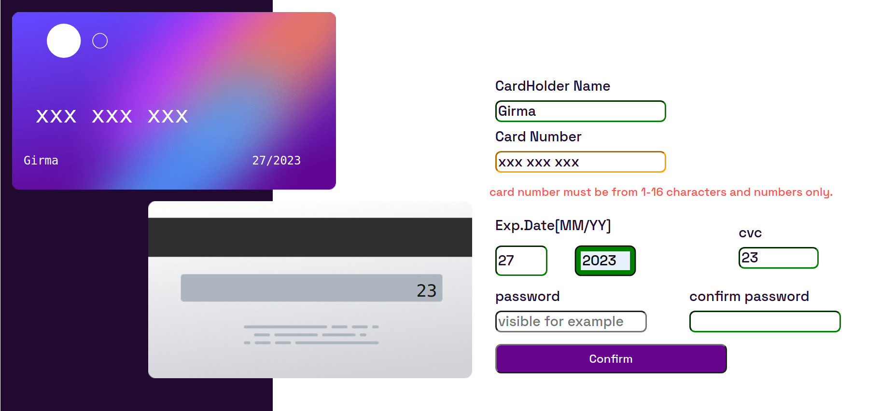
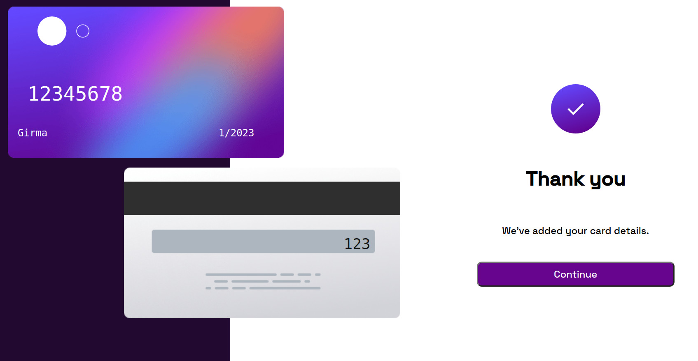

This is a solution to the [Interactive card details form challenge on Frontend Mentor](https://www.frontendmentor.io/challenges/interactive-card-details-form-XpS8cKZDWw).
 
 for this project I use
 -HTML
 -css
 -flex box method for the layout
 -and javascript to make it interactive with user by using Dom

In this project I learn more about form validation and I want to continue to learn more about form validation to make it more interactive with the user. 

for this project https://stackoverflow.com/ help me a lot. and here is the screenshot one is active and the other when completed the form.

