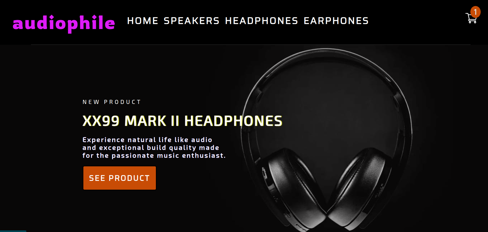
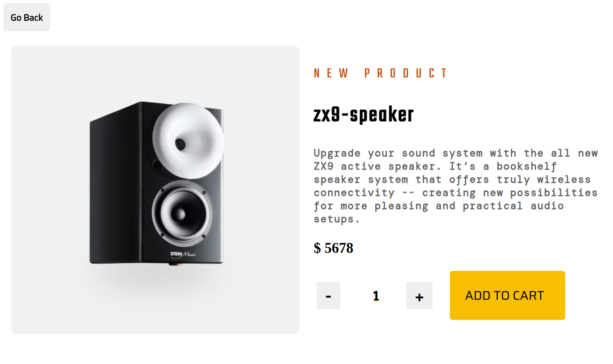
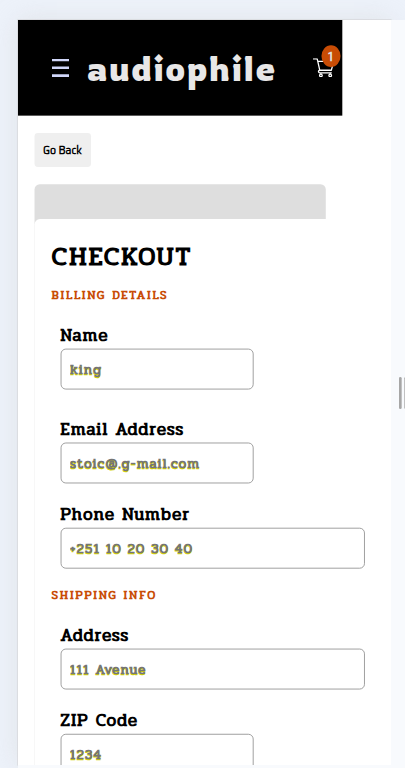
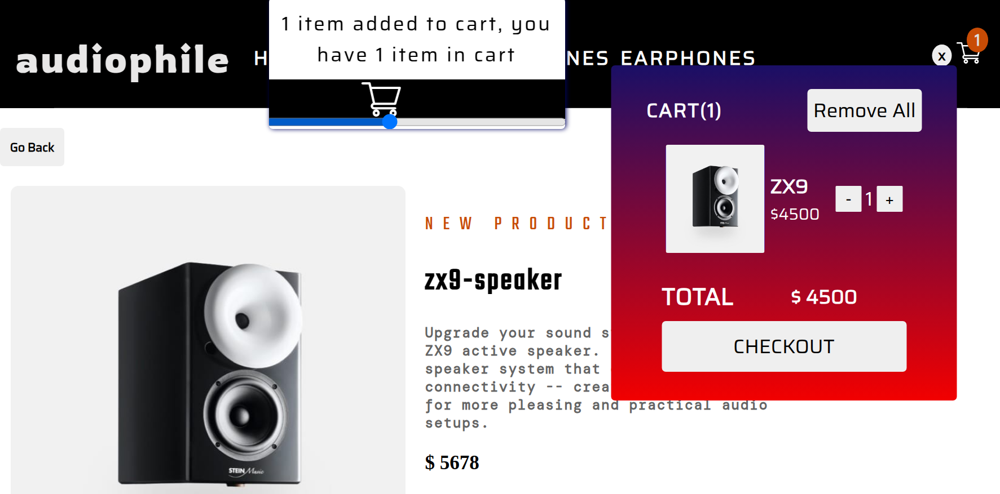

This is a solution to the [Audiophile e-commerce challenge on Frontend Mentor](https://www.frontendmentor.io/challenges/audiophile-ecommerce-website-C8cuSd_wx). Frontend Mentor challenges help you improve your coding skills by building realistic projects.

## Table of contents

- [The challenge](#the-challenge)
- [Screenshot](#screenshot)
- [Links](#links)
- [My process](#my-process)
  - [Built with](#built-with)
  - [What I learned](#what-i-learned)
  - [Continued development](#continued-development)
  - [Useful resources](#useful-resources)
- [Author](#author)
- [Acknowledgments](#acknowledgments)

### The challenge

Users should be able to:

- Add/Remove products from the cart
- Edit product quantities in the cart
- Fill in all fields in the checkout
- Receive form validations if fields are missed or incorrect during checkout
- See correct checkout totals depending on the products in the cart
- Shipping always adds $50 to the order
- VAT is calculated as 20% of the product total, excluding shipping
- See an order confirmation modal after checking out with an order summary
- View the optimal layout for the app depending on their device's screen size
- See hover states for all interactive elements on the page
- Bonus: Keep track of what's in the cart, even after refreshing the browser (localStorage could be used for this if you're not building out a full-stack app)

### Screenshot

### Links

- Live Site URL: [https://shopping-audio-e-commerce.vercel.app/]

## My process

- first time learning about testing react components and struggle on how to select element first but once the project goes on it becomes much easier and next time I'll test component using mocked state.

### Built with

- Semantic HTML5 markup
- CSS
- Flex-box
- Mobile-first workflow
- vitest
- [React](https://reactjs.org/) - JS library

### What I learned

- testing react component.
- passing and store state in url.
- using useState,useEffect ,useRef, useParams and useNavigate.
- navigation to other page or component;
- creating reusable component.

### Continued development

- Learn more about testing react app and advanced method for better state management.
